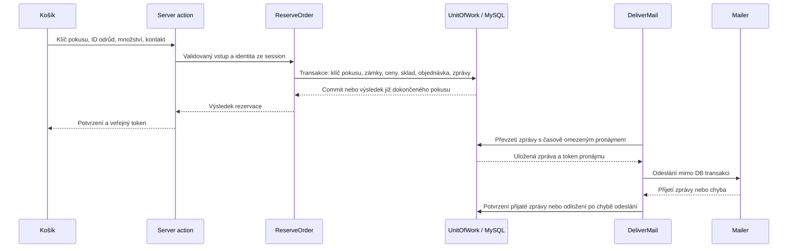

# Architektura aplikace a průběh review

14. 9. 2026. Posuzován je pracovní strom po předchozím refaktoringu, nikoli pouze
poslední commit. Navazuje na [první review](code-review.md).

Současný návrh a nasazení podrobně popisuje [spolehlivost rezervací](reliable-orders.md).
Původní nálezy jsou níže označené jako historické. Tabulka vzorů, diagram rezervace
a stav omezení odpovídají nynějšímu kódu. Nejnovější výsledky kontrol eviduje
[zpracování nálezů kvality](code-quality-remediation.md).

## Závěr

Aplikace má funkční základ vrstveného monolitu s porty a adaptéry. Use-cases
neimportují Prisma, Next.js, SMTP ani konfiguraci prostředí. Repository a Unit of Work
mají konkrétní účel: oddělují databázi a drží související změny v jedné transakci.
DTO oddělují entity od serializovaných dat komponent. Nové obecné frameworky,
generické CRUD repozitáře ani rozdělení do mikroservis tu nejsou potřeba.

Nejde o důkaz bezchybnosti nebo striktní implementaci všech pravidel DDD.
Kontrola našla níže uvedené mezery; opravy jsou odlišeny od zbývajících
rozhodnutí o spolehlivosti a růstu aplikace.

## Opravené nálezy z původních průchodů

### 1. Výsledek transakce závisel na chování konkrétního notifieru

`ReserveOrder` a `CancelOrder` po commitu čekaly na `OrderNotifier` bez vlastní
obsluhy chyby. `MailOrderNotifier` zachytával selhání SMTP, ale příprava zprávy
probíhala před tímto blokem. Náhradní adaptér nebo chyba šablony tak mohly způsobit,
že server ohlásil neúspěch, přestože rezervace a pohyb skladu už byly potvrzené.
Zákazník pak mohl akci zbytečně opakovat.

První oprava zachytávala chyby notifieru v aplikační vrstvě po commitu. Následně
byl tento tok nahrazen transakčním outboxem: příprava a uložení zpráv nyní patří
do stejné transakce jako objednávka. Selhání této přípravy transakci vrátí zpět;
samotné síťové odesílání provádí worker po commitu a výsledek objednávky již nemění.

Soubory: [ReserveOrder](../src/application/use-cases/reserve-order.ts),
[CancelOrder](../src/application/use-cases/cancel-order.ts).

### 2. Operace jednoho účtu spouštěly globální agregaci

`GetUserDetail`, `MarkUserVerified` a `SetUserActive` volaly `orderStats()` pro
všechny účty a následně vybraly jeden řádek. U mutací se tento výpočet navíc prováděl
uvnitř transakce se zamčeným uživatelem. To prodlužovalo závislost jednoduché
operace na velikosti celé databáze.

Port nově nabízí `orderStatsForUser(userId)`. SQL filtruje uživatele podle primárního
klíče a agreguje jeho objednávky spojené přes `user_id`. Seznam dál používá jeden
hromadný dotaz, takže se nezavedlo N+1. Obě varianty sdílejí výpočet statistik.
Testy ověřují shodu výsledků, cizí účet, zrušenou objednávku, prázdný a neexistující účet.

Soubory: [use-cases účtů](../src/application/use-cases/users.ts),
[PrismaUserRepository](../src/infrastructure/persistence/prisma/user-repository.ts).

### 3. Automatická kontrola vrstev měla příliš širokou výjimku pro komponenty

Původní pravidlo umožňovalo komponentám libovolnou závislost na `application`
a externích balíčcích. Přímý import use-case, `@prisma/client` nebo `next/headers`
by tak architektonickou kontrolou prošel, přestože současné komponenty této mezery
nevyužívaly.

Komponenty nyní mohou přebírat aplikační DTO typovým importem; serverové operace
volají přes `app/actions`. Pravidlo odmítne přímé use-cases, známé serverové adaptéry,
Node moduly a čtení prostředí. Ověřuje také relativní reexporty, syntaxi
`type X = import('…').X` a destrukturování `process.env`. Platné importy Reactu,
klientské navigace a DTO mají vlastní pozitivní testy.

Soubory: [pravidlo závislostí](../eslint/architecture.mjs),
[testy hranic](../tests/unit/config/architecture.test.ts).

### 4. Transakční operace byly dostupné i mimo transakci

Navazující kontrola 14. 9. 2026 uzavřela dříve zaznamenané omezení portů.
`uow.repos` i callback transakce nabízely stejné rozhraní. Vývojář tak mohl zavolat
`lockForUpdate` mimo transakci; databáze by zámek uvolnila před následným zápisem.
Také `orders.create` provádí dva zápisy: vložení objednávky a přidělení kódu podle ID.
Mimo transakci by chyba druhého zápisu zanechala objednávku s dočasným kódem.

`RepositoryBundle` nyní nabízí čtení a samostatné atomické operace.
`TransactionRepositoryBundle` přidává zámky odrůd, objednávek a účtů včetně ověřovacího
tokenu a vytvoření objednávky. Tento typ dostává pouze callback `runInTransaction`.
Společné metody se neduplikují; transakční porty rozšiřují běžné porty.

Prisma adaptéry navíc před těmito operacemi odmítnou běžného klienta. Ochrana tedy
funguje i při přímém použití adaptéru nebo obejití TypeScript typů. Továrna transakčních
repozitářů kontroluje totéž, protože Prisma typy jsou strukturálně kompatibilní.
Nejde o univerzální důkaz správnosti celé transakce: use-case stále určuje pořadí zámků,
související zápisy a čeká na jejich dokončení. Dobu života transakčního klienta hlídá Prisma.

Soubory: [porty](../src/domain/ports/repositories.ts),
[Unit of Work](../src/infrastructure/persistence/prisma/unit-of-work.ts),
[běhová pojistka](../src/infrastructure/persistence/prisma/transaction.ts),
[regrese](../tests/unit/infrastructure/transaction-boundary.test.ts),
[typový kontrakt](../tests/types/unit-of-work.ts).

## Posouzení vzorů a odpovědností

| Oblast | Posouzení |
| --- | --- |
| Dependency Inversion | Use-cases dostávají porty konstruktorovým parametrem. Konkrétní adaptéry skládá DI a serverové vstupy. Doména nevyhledává služby v globálním kontejneru. |
| Repository | Konkrétní repozitáře respektují jednotlivé oblasti a vracejí doménové typy. Neprosazuje se obecné CRUD API, které by obcházelo zámky nebo pravidla objednávek. |
| Unit of Work | Rezervace a zrušení pracují s jedním transakčním klientem. Zámky a vícekrokové vytvoření objednávky jsou dostupné přes transakční porty; adaptéry navíc odmítnou běžného klienta před SQL. |
| Rozdělení čtení a změn | Čtecí use-cases vracejí DTO, mutace koordinují pravidla a zápisy. Samostatná databáze pro čtení ani event sourcing nejsou pro současný rozsah odůvodněné. |
| Value Objects | Peníze a kilogramy mají společná pravidla výpočtu a validace. Klient neurčuje cenu objednávky. |
| Identita a historie | Vztahy používají ID a FK. Název, cena a dopravné v objednávce představují historická data. Ověření adresy pro převzetí starých hostovských objednávek je výslovná obchodní výjimka. |
| Odpovědnost modulů | `TemplateOrderMailComposer` připravuje obsah, outbox jej ukládá a `DeliverMail` řídí odeslání a potvrzení fronty. `MailUserNotifier` zajišťuje dosavadní přímé zprávy účtům. Společné šablony jsou oddělené od síťového přenosu. |
| Prezentační závislosti | Aplikační DTO obsahují české popisky. Také `Order.itemsLabel` stále formátuje souhrn položek. Pro českou aplikaci je to malá známá vazba; při vícejazyčnosti by formátování mělo přejít do samostatné prezentace. |
| Stav Reactu | Serverové seznamy se zbytečně neduplikují. Rozepsaný skladový formulář drží vlastní stav a očekávaný sklad; konflikt vyžaduje vědomé obnovení. |
| Autorizace | Stránky a akce ověřují současný účet před přístupem k administrativním datům. Serverová hranice volá aplikační `AuthorizeSession` nebo `AuthorizeFarmerSession`; pravidlo role není podruhé v infrastruktuře. |

Tok rezervace:

## Původní omezení a jejich současný stav

| Bod | Původní omezení | Současný stav |
|---|---|---|
| 1 | Opakovaný požadavek mohl vytvořit druhou rezervaci. | Vyřešeno stabilním klíčem pokusu a záznamem `ReservationRequest` ve stejné transakci. Stejný obsah vrací původní objednávku, odlišný obsah se odmítne. |
| 2 | Pád po commitu mohl ztratit oznámení. | Vyřešeno trvalým outboxem a samostatným workerem. Síťové odeslání probíhá mimo transakci. |
| 3 | Seznamy a historie účtů neměly stránkování. | Vyřešeno stránkami objednávek, uživatelů a historie účtu; statistiky seznamu se načítají pro konkrétní ID na stránce. |
| 4 | Limiter a uploady nejsou připravené pro více replik. | Otevřené omezení: token bucket je v procesu a uploady na svazku. Více webových replik vyžaduje společný limiter a dostupné úložiště. |
| 5 | Nové cenové pravidlo mohlo změnit historické součty. | Vyřešeno čtením uložených částek položek a objednávky, slevy a verze výpočtu. Pravidla kuponů a kombinování slev zatím nejsou implementovanou funkcí. |

Pošta má vlastnost „alespoň jednou“: pád nebo chyba potvrzení po přijetí zprávy
odesílatelem může vést k opakovanému doručení. Stabilní `Message-ID` není záruka
deduplikace příjemcem. `DeliverMail` rozlišuje chybu odeslání od chyby potvrzení
fronty; při druhé z nich neuvolní pronájem předčasně. Pravidla obnovení a provozní
postup jsou v [popisu fronty](reliable-orders.md).

## Ověření původního druhého průchodu

- Statický graf **111 produkčních TS/TSX souborů**: žádný cyklus v importech ani
  v importech po odstranění TypeScript typů.
- Průchod závislostí od `use client`: žádný dosažený soubor infrastruktury při
  respektování `use server` jako hranice serverové akce.
- Cílené regrese notifierů, statistik a importů: **34 / 34 prošlo**.
- Celá unit sada s pokrytím: **367 / 367**, 31 souborů; měřené vrstvy `domain`
  a `application` mají 85,66 % pokrytí řádků a 92,66 % větví.
- Integrace proti oddělené MySQL 8.4: **28 / 28**, 3 soubory.
- ESLint, typová kontrola a produkční `next build`: úspěch.
- Prohlížečové scénáře nebyly v tomto průchodu opakovány; poslední výsledek
  44 úspěšných a 3 přeskočených patří k prvnímu review.

Graf vychází z dohledatelných modulových importů, nikoli z libovolně vypočtených
cest, vloženého kódu či chování externích knihoven. ESLint je kontrola návrhu,
nikoli bezpečnostní sandbox. Testovací pošta nic skutečně neodesílá.

## Ověření navazující opravy transakčních portů

- Nové regrese: **7 / 7**. Neplatná volání neprovedou SQL ani INSERT objednávky.
- Unit sada: **351 úspěšných**, zbývajících **23 úspěšných při cíleném opakování**.
  První běh těchto 23 skončil timeoutem 60 s při načítání konfigurace ESLintu;
  při opakování načtení i testy trvaly přibližně 1,7 s.
- Integrace proti oddělené MySQL na portu 3318: **28 / 28**.
- ESLint a typová kontrola prošly včetně negativních testů kontraktu v `tests/types`.
- Datový model ani migrace se neměnily. Produkční build a E2E nebyly v tomto
  navazujícím kroku opakovány; dřívější výsledky jsou uvedeny výše.
